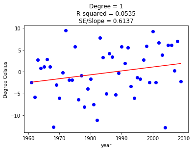
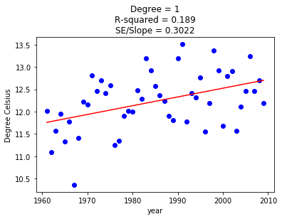
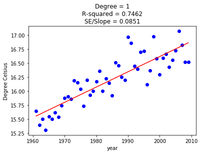
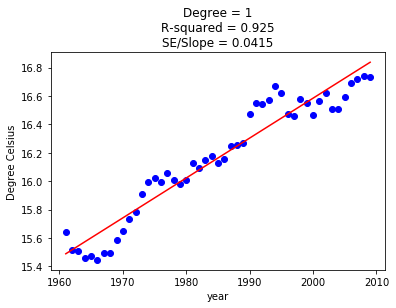

# MITOCW_6.0002_Asg5-Regression_on_US-climate_data
Analyzing the temperature changes trend across 22 US cities over 55 years

Uses classes to build data cleaning and vaidation functions

Some output plots:

1. NEW YORK temperatures on 10-Jan each year

2. NEW YORK average temperature over the years

3. Average Temperature of 22 Cities over the years

4. 5-year Moving Average Temperature for 22 Cities

